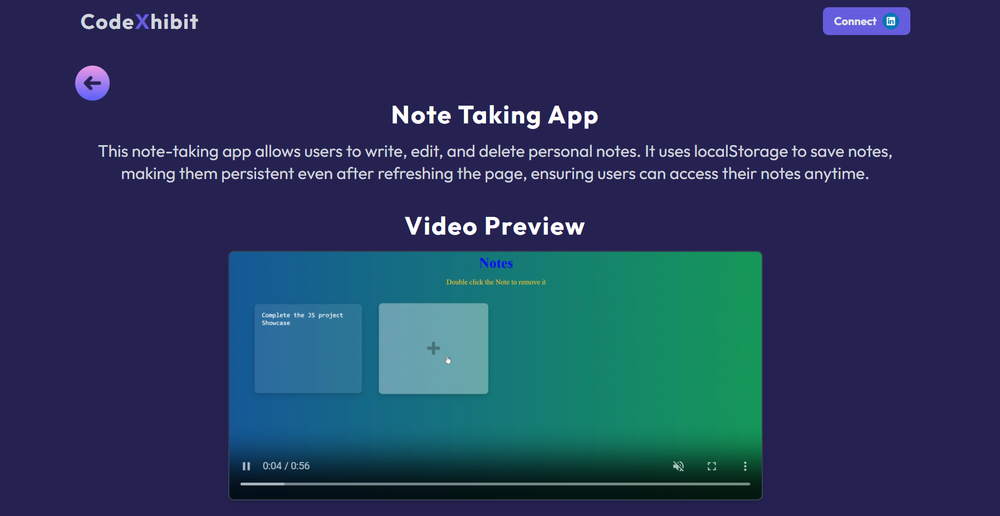

# 🌟 CodeXhibit

**CodeXhibit** is a showcase of 35 Mini JavaScript projects built with React! Dive into a clean, responsive, and dynamic interface that highlights the power and versatility of JavaScript.

---

## 🚀 Features

- 🎨 **Showcase 35 Mini JavaScript Projects**: Explore a curated collection of JavaScript projects.
- 🛤️ **Dynamic Routing**: Seamlessly navigate through individual project details with React Router.
- 🔔 **Notifications**: Receive user feedback with toast alerts powered by `react-toastify`.
- 📱 **Responsive Design**: Fully optimized for all screen sizes.
- ⚡ **Reusable Components**: Modular and scalable React architecture.

---

## 🌐 Live Demo

👉 [View CodeXhibit Live!](https://js-project-show-case.vercel.app/)

---

## 🛠️ Tech Stack

- **React**: For building the UI.
- **React Router**: To enable smooth navigation.
- **React Toastify**: For notifications.
- **Tailwind CSS**: For styling.
- **JavaScript**: The core of all showcased projects.

---

## 📥 Installation

Follow these steps to run the project locally:

1. **Clone the repository**:
   ```bash
   git clone https://github.com/SyedShahulAhmed/JS-ProjectShowCase.git
   ```

2. **Install dependencies**:
   ```bash
   npm install
   ```

3. **Start the development server**:
   ```bash
   npm run dev
   ```

4. **Open the app**: Visit [http://localhost:3000](http://localhost:3000) in your browser.

---

## 🖼️ Screenshots


### 🏠 Home Page


### 🔍 Project Details Page



---

## 🤝 Contributions

We welcome contributions! Here's how you can help:

1. Fork this repository.
2. Create a new branch:
   ```bash
   git checkout -b feature-name
   ```
3. Make your changes and commit:
   ```bash
   git commit -m "Add feature-name"
   ```
4. Push to your branch:
   ```bash
   git push origin feature-name
   ```
5. Open a pull request on GitHub.


## 💬 Contact

Feel free to reach out for questions or suggestions:

- **Author**: Shahul Ahmed
- **Email**: shahul77235@gmail.com
- **GitHub**: [https://github.com/SyedShahulAhmed](https://github.com/SyedShahulAhmed)


